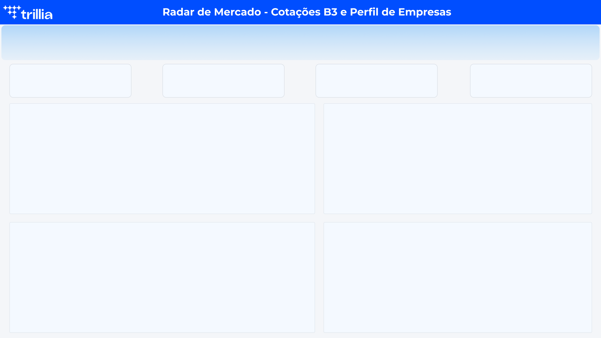
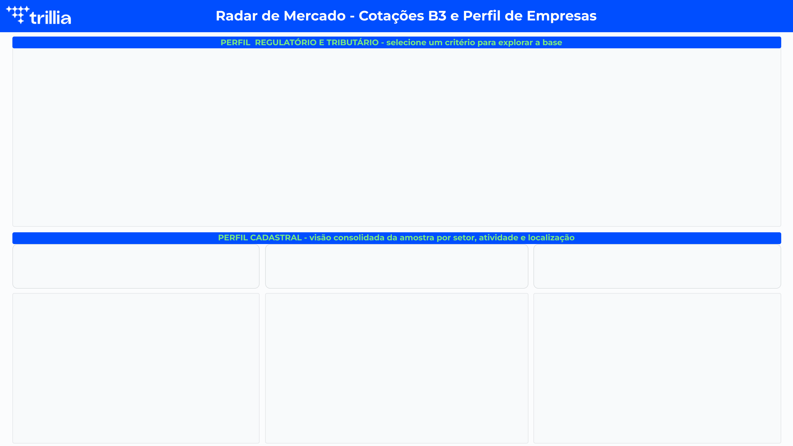

# Projeto de Business Intelligence Completo (Teste Trillia)

Projeto de BI desenvolvido a partir de duas bases de negócio fornecidas: (1) empresas listadas na B3 e cotações de um período de ~9 meses, e (2) uma amostra de empresas brasileiras.

## Objetivo

Construir um pipeline de ETL e um modelo dimensional para alimentar dashboards no Power BI, propondo análises relevantes a partir dos dados fornecidos.

## Estrutura do projeto

├── app/ # Aplicação final em Power BI (.pbix)
├── files/
│ ├── spreadsheets/ # Bases originais fornecidas (.csv)
│ ├── raw/ # Saída da etapa de Extract — cópia fiel da origem
│ ├── clean/ # Saída da etapa de Transform — dados tratados
│ └── enrich/ # Saída da etapa de Load — tabelas finais do modelo
├── scripts/
│ ├── extract/ # 1 script por base (7 no total)
│ ├── transform/ # 1 script por base (7 no total)
│ └── load/ # 1 script por peça do modelo dimensional (9 no total)
└── README.md

## Pipeline de ETL

O pipeline segue três etapas, cada uma com responsabilidade única:

1. **Extract**: lê cada uma das 7 bases originais, valida existência, integridade (não vazio) e colunas esperadas, e grava uma cópia fiel em `files/raw/`. Nenhuma transformação de dado acontece aqui.
2. **Transform**: lê `files/raw/`, aplica limpeza (tratamento de nulos, tipos de dado, padronização de texto) e grava em `files/clean/`. Cada script valida que o número de linhas não muda durante a limpeza.
3. **Load**: lê `files/clean/` e monta as tabelas finais do modelo dimensional, já prontas para o Power BI, em `files/enrich/`.

Optei por um script por base em cada etapa (em vez de um script único cuidando de tudo), priorizando legibilidade e rastreabilidade — cada arquivo pode ser lido e entendido isoladamente.

## Decisões de modelagem

O modelo foi dividido em dois blocos, refletindo as duas bases de negócio do enunciado:

### Bloco 1 — Mercado de Ações (B3)
Modelo estrela clássico:
- `Fato_Cotacoes` (grão: 1 ação × 1 dia × 1 tipo de mercado)
- `Dim_Empresa_B3`, `Dim_Data`, `Dim_Mercado`

### Bloco 2 — Perfil de Empresas Brasileiras
Composto por 5 tabelas: `Dim_Cadastro_Empresas`, `Dim_Porte_Empresas`, `Dim_Atividade_Empresas`, `Dim_Saude_Tributaria_Empresas`, `Dim_Simples_Empresas`.

**Decisão importante:** durante a exploração dos dados, identifiquei que essas 5 tabelas — apesar de terem volumes de linha muito parecidos (~11.850 cada) — compartilham apenas 3% a 6% de CNPJs em comum entre si. Ou seja, não representam a mesma população de empresas vista por ângulos diferentes, e sim amostras majoritariamente independentes.

Diante disso, optei por **não fundir** essas tabelas em uma única dimensão larga (o que geraria ~95% de valores nulos), e sim tratá-las como **populações independentes**, cada uma sustentando sua própria análise. A única exceção é `Dim_Cadastro_Empresas`, que apresenta ~96% de correspondência de CNPJ com `Dim_Empresa_B3` (Bloco 1) e por isso está conectada a ela como uma dimensão *outrigger* (técnica de modelagem dimensional para dimensões conectadas indiretamente à fato, através de outra dimensão).

## Qualidade de dados — achados relevantes

- **Correção de bug em `tp_merc`/CNPJ**: a leitura inicial de colunas de CNPJ sem especificar tipo de dado (`dtype=str`) causava perda de zeros à esquerda pelo pandas (conversão automática para inteiro). Identificado e corrigido na etapa de Extract, afetando ~13% dos registros em 5 das 7 bases.
- **Inconsistência de digitação em `setor_economico`**: identificado o valor
  "PETRÓLEO. GÁS E BIOCOMBUSTÍVEIS" (erro de digitação, com ponto) coexistindo com a forma correta "PETRÓLEO, GÁS E BIOCOMBUSTÍVEIS" (com vírgula) na base `empresas_bolsa`. Corrigido
  na etapa de Transform via mapa de correção (`CORRECOES_SETOR`).
- **Baixa correspondência de CNPJ entre bases satélite do Bloco 2** (detalhado acima), que direcionou a decisão de mantê-las independentes.

## Dashboard

O dashboard final está em `app/Dashboard_Trillia_Fabiano_Ferraz.pbix` e é composto por duas páginas:

### Página 1 — Radar de Mercado
Visão consolidada das cotações da B3 no período: volume financeiro, quantidade de negócios,
preço médio e variação de mercado, com evolução mensal do preço, distribuição por tipo de
mercado (à vista / opções) e ranking de empresas por volume negociado. Filtros por ano, mês,
dia da semana, setor econômico, segmento B3 e tipo de mercado.

### Página 2 — Perfil de Empresas
Explora o Bloco 2 do modelo (empresas da amostra brasileira) sob dois ângulos:
- **Perfil regulatório/tributário** (dinâmico): um parâmetro alternável permite explorar a
  distribuição de CNPJs por porte, nível de atividade, saúde tributária ou regime tributário
  (Simples), via uma tabela unificada que combina as 4 dimensões independentes.
- **Perfil cadastral** (fixo): visão consolidada por setor econômico, ramo de atividade e
  distribuição geográfica (UF), usando `Dim_Cadastro_Empresas`.

